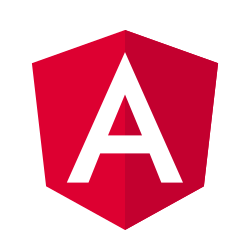

# Component Party 🎉

[](https://gitpod.io/#https://github.com/matschik/component-party)

> Web component JS frameworks quick overview by their syntax and features

**Website: https://component-party.dev**

## Why ?

Many JS developers don't have a good overview of every existing JS framework with their own syntax and features.
How do we solve this ? Developers love having framework overview by examples. It's a quick introduction before going deeper.

## Roadmap

*   \[ ] Add Preact
*   \[ ] Add Stencil
*   \[ ] Add native JS ?

## Progression

<details>
        <summary>
            
            <b>Svelte</b>
            </summary>

* [x] Reactivity
   * [x] Declare state
   * [x] Update state
   * [x] Computed state
* [x] Templating
   * [x] Minimal template
   * [x] Styling
   * [x] Loop
   * [x] Event click
   * [x] Dom ref
   * [x] Conditional
* [x] Lifecycle
   * [x] On mount
   * [x] On unmount
* [x] Component composition
   * [x] Props
   * [x] Emit to parent
   * [x] Slot
   * [x] Slot fallback
* [x] Form input
   * [x] Input text
   * [x] Checkbox
   * [x] Radio
   * [x] Select
* [x] Webapp features
   * [x] Routing
   * [x] Router link

</details><details>
        <summary>
            
            <b>React</b>
            </summary>

* [x] Reactivity
   * [x] Declare state
   * [x] Update state
   * [x] Computed state
* [x] Templating
   * [x] Minimal template
   * [x] Styling
   * [x] Loop
   * [x] Event click
   * [x] Dom ref
   * [x] Conditional
* [x] Lifecycle
   * [x] On mount
   * [x] On unmount
* [x] Component composition
   * [x] Props
   * [x] Emit to parent
   * [x] Slot
   * [x] Slot fallback
* [x] Form input
   * [x] Input text
   * [x] Checkbox
   * [x] Radio
   * [x] Select
* [x] Webapp features
   * [x] Routing
   * [x] Router link

</details><details>
        <summary>
            
            <b>Vue 3</b>
            </summary>

* [x] Reactivity
   * [x] Declare state
   * [x] Update state
   * [x] Computed state
* [x] Templating
   * [x] Minimal template
   * [x] Styling
   * [x] Loop
   * [x] Event click
   * [x] Dom ref
   * [x] Conditional
* [x] Lifecycle
   * [x] On mount
   * [x] On unmount
* [x] Component composition
   * [x] Props
   * [x] Emit to parent
   * [x] Slot
   * [x] Slot fallback
* [x] Form input
   * [x] Input text
   * [x] Checkbox
   * [x] Radio
   * [x] Select
* [x] Webapp features
   * [x] Routing
   * [x] Router link

</details><details>
        <summary>
            
            <b>Angular</b>
            </summary>

* [x] Reactivity
   * [x] Declare state
   * [x] Update state
   * [x] Computed state
* [x] Templating
   * [x] Minimal template
   * [x] Styling
   * [x] Loop
   * [x] Event click
   * [x] Dom ref
   * [x] Conditional
* [x] Lifecycle
   * [x] On mount
   * [x] On unmount
* [x] Component composition
   * [x] Props
   * [x] Emit to parent
   * [x] Slot
   * [x] Slot fallback
* [x] Form input
   * [x] Input text
   * [x] Checkbox
   * [x] Radio
   * [x] Select
* [x] Webapp features
   * [x] Routing
   * [x] Router link

</details><details>
        <summary>
            
            <b>SolidJS</b>
            </summary>

* [x] Reactivity
   * [x] Declare state
   * [x] Update state
   * [x] Computed state
* [x] Templating
   * [x] Minimal template
   * [x] Styling
   * [x] Loop
   * [x] Event click
   * [x] Dom ref
   * [x] Conditional
* [x] Lifecycle
   * [x] On mount
   * [x] On unmount
* [x] Component composition
   * [x] Props
   * [x] Emit to parent
   * [x] Slot
   * [x] Slot fallback
* [x] Form input
   * [x] Input text
   * [x] Checkbox
   * [x] Radio
   * [x] Select
* [ ] Webapp features
   * [ ] Routing
   * [ ] Router link

</details><details>
        <summary>
            
            <b>Lit</b>
            </summary>

* [x] Reactivity
   * [x] Declare state
   * [x] Update state
   * [x] Computed state
* [x] Templating
   * [x] Minimal template
   * [x] Styling
   * [x] Loop
   * [x] Event click
   * [x] Dom ref
   * [x] Conditional
* [x] Lifecycle
   * [x] On mount
   * [x] On unmount
* [x] Component composition
   * [x] Props
   * [x] Emit to parent
   * [x] Slot
   * [x] Slot fallback
* [x] Form input
   * [x] Input text
   * [x] Checkbox
   * [x] Radio
   * [x] Select
* [ ] Webapp features
   * [ ] Routing
   * [ ] Router link

</details><details>
        <summary>
            
            <b>Ember</b>
            </summary>

* [x] Reactivity
   * [x] Declare state
   * [x] Update state
   * [x] Computed state
* [ ] Templating
   * [ ] Minimal template
   * [ ] Styling
   * [ ] Loop
   * [ ] Event click
   * [ ] Dom ref
   * [ ] Conditional
* [ ] Lifecycle
   * [ ] On mount
   * [ ] On unmount
* [ ] Component composition
   * [ ] Props
   * [ ] Emit to parent
   * [ ] Slot
   * [ ] Slot fallback
* [ ] Form input
   * [ ] Input text
   * [ ] Checkbox
   * [ ] Radio
   * [ ] Select
* [ ] Webapp features
   * [ ] Routing
   * [ ] Router link

</details><details>
        <summary>
            
            <b>Alpine.js</b>
            </summary>

* [x] Reactivity
   * [x] Declare state
   * [x] Update state
   * [x] Computed state
* [x] Templating
   * [x] Minimal template
   * [x] Styling
   * [x] Loop
   * [x] Event click
   * [x] Dom ref
   * [x] Conditional
* [x] Lifecycle
   * [x] On mount
   * [x] On unmount
* [x] Component composition
   * [x] Props
   * [x] Emit to parent
   * [x] Slot
   * [x] Slot fallback
* [x] Form input
   * [x] Input text
   * [x] Checkbox
   * [x] Radio
   * [x] Select
* [ ] Webapp features
   * [ ] Routing
   * [ ] Router link

</details>

## Contributing

This site is built with [Astro](https://docs.astro.build). Site content is written in Markdown format located in `content`. For simple edits, you can directly edit the file on GitHub and generate a Pull Request.

For local development, [pnpm](https://pnpm.io/) is preferred as package manager:

```bash
pnpm i
pnpm run dev
```

This project requires Node.js to be `v14.0.0` or higher, because we use new JavaScript features in our code, such as optional chaining.

### Add a framework

1.  Fork the project and create a new branch
2.  Add the new framework SVG logo in `public/framework`
3.  Install the ESLint plugin associated to the framework
4.  In `src/frameworks.mjs`, add a new entry with SVG link and ESLint configuration
